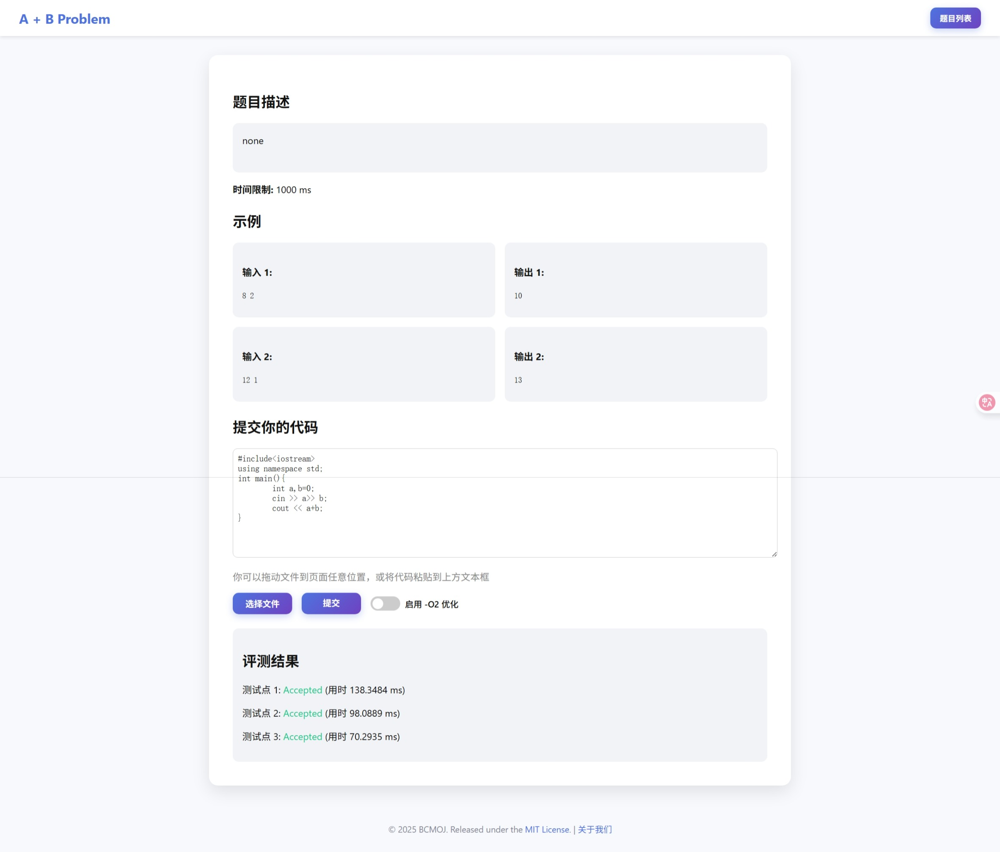
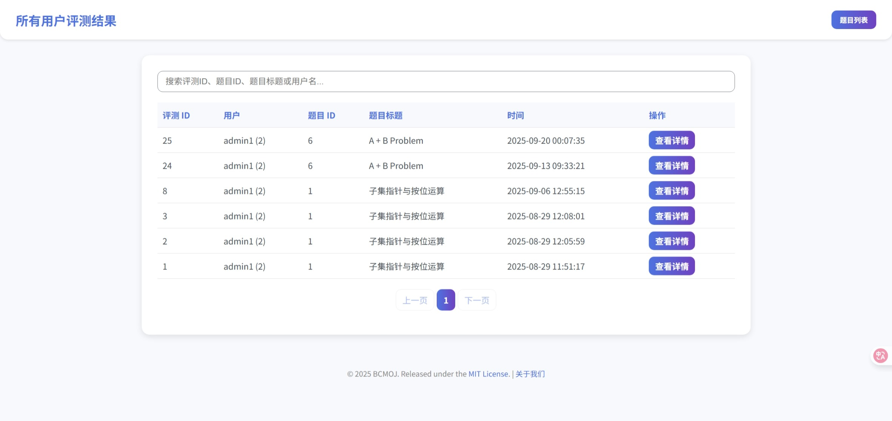
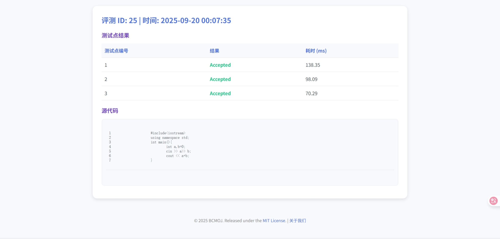

> [!WARNING]
> **这个项目目前处于开发阶段,可能存在未经查明的bug
> 如果您发现任何bug，请在[issue](https://github.com/SleepingCui/BCMOJ/issues)中反馈。**
---
## **BCMOJ** ———一个轻量化的在线代码评测系统<sub>~~(几位初中生花100+h堆石山代码堆出来的玩意)~~</sub>

### 特点

- 多模式判题 (忽略空格,不区分大小写,浮点容错)
- Markdown + LaTeX 支持
- 基于cgroup的内存限制 **(Linux Only)**
- 微服务架构,WebApp与JudgeServer分离
- WSGI支持
- Docker支持


### 配置示例

```json
{ 
  "timeLimit": 1145,
  "memLimit": 1000,
  "securityCheck": false,
  "enableO2": true,
  "compareMode": 1,
  "checkpoints": {
    "1_in": "1145",
    "1_out": "14",
    "2_in": "1919",
    "2_out": "810"
  }
}
```

### 判题结果示例

```json
{
  "1_res": 1,
  "1_time": 15.2041,
  "1_mem": 133,
  "2_res": 1,
  "2_time": 18.5166,
  "2_mem": 133
}
```

### 状态码说明

| 状态码 | 含义                     |
| ------ | ------------------------ |
| -5     | Security Check Failed    |
| -4     | Compile Error            |
| -3     | Wrong Answer             |
| 2      | Real Time Limit Exceeded |
| 3      | Memory Limit Exceeded    |
| 4      | Runtime Error            |
| 5      | System Error             |
| 1      | Accepted                 |


## 安装&使用
### 详见[Wiki](https://github.com/SleepingCui/BCMOJ/wiki)

## 致谢
- 感谢[@MxingFoew1034](https://github.com/MxingFoew1034)在代码方面的支持和协作
- 感谢[@LeiXu](https://github.com/853683892)在架构方面的支持
- 以及本项目中使用的[第三方库](THIRD_PARTY_LIBS.md)

---

## ScreenShots

<p align="center">
  
  
  
  
</p>
