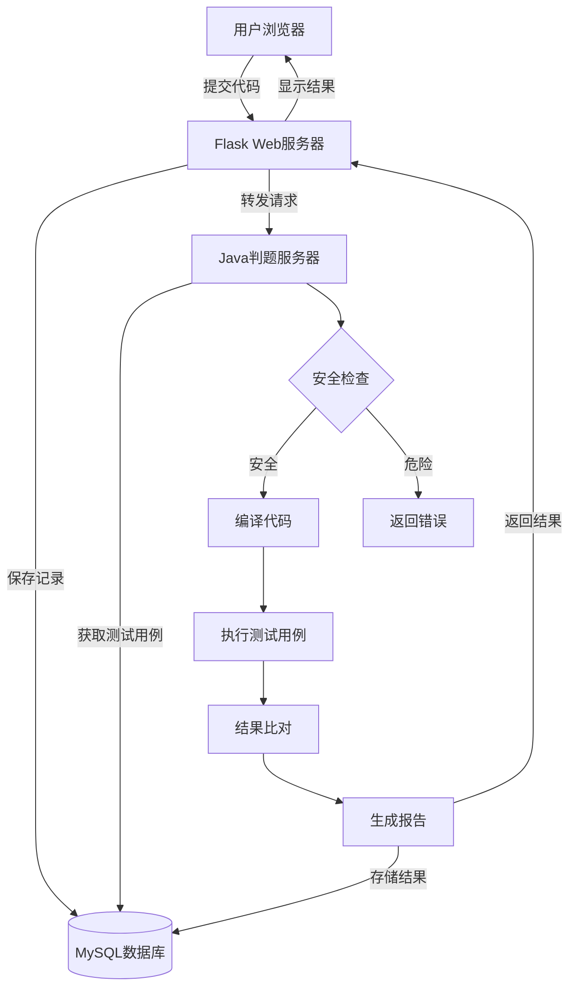

  

  

> [!WARNING]
> **这个项目目前处于开发阶段,可能存在未经查明的bug
> 如果发现bug,请提出[issue](https://github.com/SleepingCui/BCMOJ/issues)**
### **BCMOJ** ———一个轻量化的在线代码评测系统 ~~(两位初中生花100+h堆石山代码堆出来的玩意)~~
---

## 项目架构

---

## 如何使用

### 详见[Wiki](https://github.com/SleepingCui/BCMOJ/wiki)

---

## ScreenShots

  
  
  

